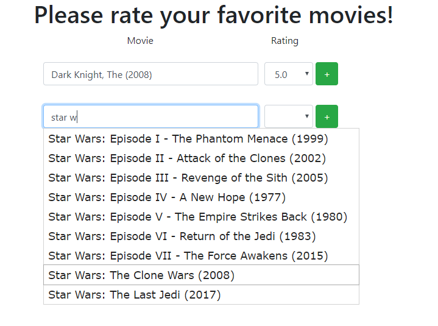

# movie_recommendation_app

## Movie Recommendation Web Application

This web application employs the use of Principal Component Analysis (PCA) for recommending movies based on user submitted movie ratings. <br />
1. Movie Ratings Form
This form consists of dynamically generated rows for movie ratings and autocomplete fields. Users can fill in several movies they like or dislike and their corresponding ratings for each movie.

1. Movie Recommendation List
A list of movie recommendations will be generated based on the submitted form. This list is the result of executing PCA to predict user-ratings of other movies in the database. Users may click on each movie to be redirected the respected detail page. Note: any movie that an user has rated will not be in this list of recommendation.


### Included:
* source code
* movie data (data/) released by MovieLens
* populate_movie_app.py: a script to extract .csv movie data and populate database

### Requirement:
* 3rd party python packages: numpy, scipy
* Python 3 (tested with 3.7.3 on Windows)
* Django (tested with 2.2.3 on Windows)

### To run:
```
python manage.py runserver
```